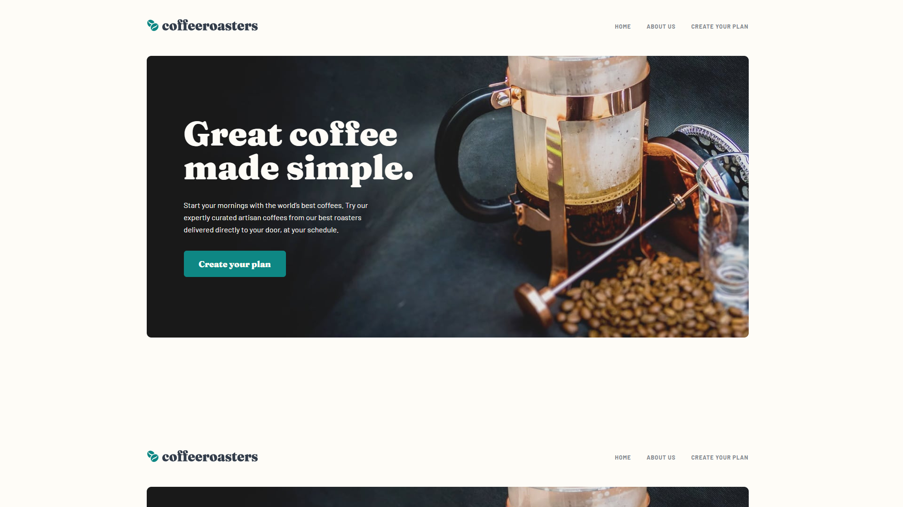

# Frontend Mentor - Coffeeroasters subscription site solution

This is a solution to the [Coffeeroasters subscription site challenge on Frontend Mentor](https://www.frontendmentor.io/challenges/coffeeroasters-subscription-site-5Fc26HVY6). Frontend Mentor challenges help you improve your coding skills by building realistic projects.

## Table of contents

- [The challenge](#the-challenge)
- [Built with](#built-with)
- [Screenshot](#screenshot)
- [Links](#links)

# The challenge

Users should be able to:

- View the optimal layout for each page depending on their device's screen size
- See hover states for all interactive elements throughout the site
- Make selections to create a coffee subscription and see an order summary modal of their choices

# Screenshot

# Links

- [Repo](https://github.com/ursasimenc/svelte-coffeeroasters)
- [Demo](https://us-coffeeroasters.netlify.app)

# Built with

- [SvelteKit](https://kit.svelte.dev/)
- [Sass](https://sass-lang.com/) - CSS preprocessor
- [TypeScript](https://www.typescriptlang.org/) - JS superset
